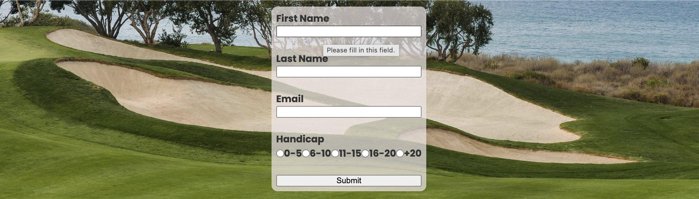

# Free Golf Coach

Free golf site is a library for useful golf tutorial videos for golfers of all levels. 
Users of this site will have a passion for golf and for sharing useful tutorials they have found online. 
As site owner, I want to create a space/community for people who love golf and sharing their favourite tutorials.
Ultimately, I would like this to be a content management site where users can share the content of others or post their own content. 

## Existing Features

### Navbar
- __Navigation Bar__

  - Responsive navbar has been included on all three pages. Includes links to Logo, Home, Long Game and Short Game pages.
  - Bottom border to show user their current location in the site.
  - Dropdown menu for smaller screens.
  

### Home Page Image
- __Home Page Image__
  
  - Image of golfer at the top of their follow-through with a scenic background. Found on www.freepik.com.
  - Responsive textbox overlay. Opacity used for contrast while not disturbing the image

### Community
- __Community__

  - Community banner in keeping with navbar. (used H1 element to ensure text in keeping with header).
  - Image of a bunker with a scenic view. Found on pexels.com.
  - Responsive Sign up form for site users to join our community and subscribe to weekly newsletter. Opacity used for contrast while not disturbing the image. Allow user to optionally provide their handicap.

### Footer
- __Footer__
  - Responsively styled footer section containing external links to all relevant social media sites.
  

### Long Game Image
- __Long Game Image__
  - Image of golfer at top of their follow-through with a scenic background. Found on www.freepik.com.
  - This image was used as it is from the same creator as the Home page and Short Game image. It is difficult to find golf related images with a central focal point and similar colors.
  - Responsive textbox overlay. Opacity used for contrast while not disturbing the image.

### Video Content
- __Video Content__
  - Included video content for long game and short game pages.
  - These videos are from some of my favourite golf content creators.
  - Vidoes have been embedded from youtube and have audio and fullscreen capabilities.
  - They are on a responsive div and include a scrollbar for ease of use.

### Short Game Image
- __Short Game Image__
  - Image of golfer in a bunker with a scenic background. Found on www.freepik.com.
  - This image was used as it is from the same creator as the Home page and Long Game image. It is difficult to find golf related images with a central focal point and similar colors.
  - Responsive textbox overlay. Opacity used for contrast while not disturbing the image.

### Additional features
- __CMS__
  - Ultimately, I would like to create a content management site but don't yet possess the skills. I want to give users the ability to have their own page, upload and interact with content.

## Testing

### Testing Table

| Action    | Expectation | Result | 
| ---------|:-------------------:|----------|
| Enter URL | Arrive at Home | Arrive at Home |
| Click Logo | Arrive at Home | Arrive at Home |
| Click Home | Arrive at Home | Arrive at Home |
| Click Home | Arrive at Home, Home link underlined | Arrive at Home, Home link underlined |
| Click Long Game | Arrive at Long Game | Arrive at Long Game |
| Click Long Game | Arrive at Long Game, Long Game underlined | Arrive at Long Game, Long Game underlined |
| Click Short Game | Arrive at Short Game | Arrive at Short Game |
| Click Short Game | Arrive at Short Game, Short Game underlined | Arrive at Short Game, Short Game underlined |
| Click Facebook Logo | Arrive at Facebook Home | Arrive at Facebook Home |
| Click X Logo | Arrive at X Home | Arrive at X Home |
| Click Instagram Logo | Arrive at Instagram Home | Arrive at Instagram Home |
| Click Youtube Logo | Arrive at Youtube Home | Arrive at Youtube Home |
| Click Videos (Long Game) | Video plays | Video plays |
| Click Videos Fullscreen (Long Game) | Video plays Fullscreen | Video plays Fullscreen |
| Click Videos (Short Game) | Video plays | Video plays |
| Click Videos Fullscreen (Short Game) | Video plays | Video plays |
| Header Responsivity | Change for screen size | Change for screen size |
| Footer Responsivity | Change for screen size | Change for screen size |
| Text Responsivity | Change for screen size | Change for screen size |
| Video container Responsivity | Change for screen size | Change for screen size |

  - All video links have been tested for audio and fullscreen 

### Validator Testing
- __HTML__
  - No errors returend through W3C validator.

- __CSS__
  - No errors returned through jigsaw validator.

### Unfixed Bugs
- __Video Content__
  - I would like to add additional styling to video containers. I want to only show one video in each container at a time and allow users to click an arrow to scroll through to their preferred video.(I did some research and this required javascript).

## Deployment

- The site was deployed to GitHub pages. The steps to deploy are as follows:
  - In the GitHub repository, navigate to the Settings tab
  - From the source section drop-down menu, select the Master Branch
  - Once the master branch has been selected, the page will be automatically refreshed with a detailed ribbon display to indicate the successful deployment.

- The live link can be found here: <https://seanfreaney.github.io/free-golf-coach/>

## Credits

### Navbar
W3C Schools
<https://www.w3schools.com/howto/howto_css_dropdown_navbar.asp#:~:text=Use%20a%20container%20element%20(like>,dropdown%20menu%20correctly%20with%20CSS

### Font Awesome
- __Link__
  - Youtube
  - <https://www.youtube.com/watch?v=8-VRIEaIKqI>

- __Icons__
  - Icons from Font Awesome.

### Media
- __Youtube__
  - Tutorial videos are all taken from Youtube.
- __Freepik.com__
  - Background images for Home, Short Game and Long Game pages.
- __Pexels.com__
  - Background image for Community. 

### Images

